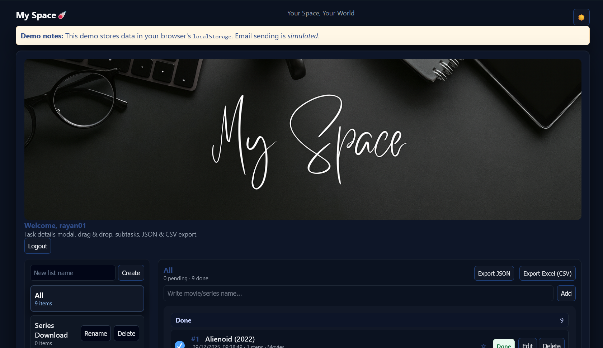

# 🌌 My Space☄️

**My Space** is a modern, client-side task and media tracking web application built using **HTML, CSS, and JavaScript**.  
It allows users to manage movies, series, and personal tasks with authentication, lists, subtasks, and export features — all running fully in the browser.

---

## 🌐 Live Demo

👉 **GitHub Pages:**  
https://raihan014.github.io/My-Space/

---

## ✨ Features

- 🔐 Login / Register system (client-side demo)
- 📧 Email verification & password reset (simulated)
- 🗂️ Create custom lists (Movies, Series, Drama, etc.)
- ✅ Mark tasks as Pending / Done
- ⭐ Star important items
- 🧩 Subtasks with progress tracking
- 🖱️ Drag & drop tasks between lists
- 📤 Export data as **JSON** and **CSV (Excel)**
- 🌙 Dark mode toggle
- ⌨️ Enter-key support for all forms
- 👁️ Show / hide password option
- 💾 Data stored in browser **localStorage**

---

## 🛠️ Built With

- **HTML5**
- **CSS3**
- **Vanilla JavaScript**
- **LocalStorage API**

> ⚠️ This is a **client-side prototype**.  
> No real backend or email service is used.

---

## 📸 Preview



---

## 🚀 Getting Started (Run Locally)

1. Clone the repository:
   ```bash
   git clone https://github.com/raihan014/My-Space.git
